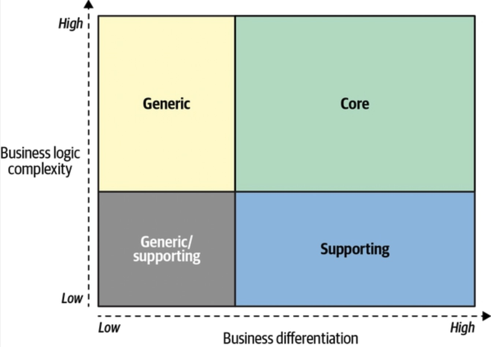

> Domain-driven design (DDD) proposes to attack the root cause for failed software projects from a different angle. Effective communication is the central theme of the domain-driven design tools and practices you are about to learn in this book.

> The strategic tools of DDD are used to analyze business domains and strategy, and to foster a shared understanding of the business between the different stakeholders.

> DDD’s tactical patterns allow us to write code in a way that reflects the business domain, addresses its goals, and speaks the language of the business.

> There is no sense in talking about the solution before we agree on the problem, and no sense talking about the implementation steps before we agree on the solution.

> To design and build an effective solution, you have to understand the problem. The problem, in our context, is the software system we have to build. To understand the problem, you have to understand the context within which it exists—the organization’s business strategy, and what value it seeks to gain by building the software.

> Domain-driven design distinguishes between three types of subdomains: core, generic, and supporting.

> A core subdomain is what a company does differently from its competitors. […] A core subdomain that is simple to implement can only provide a short-lived competitive advantage. Therefore, core subdomains are naturally complex.

> It’s important to note that core subdomains are not necessarily technical. Not all business problems are solved through algorithms or other technical solutions.

> Generic subdomains are business activities that all companies are performing in the same way.

> As the name suggests, supporting subdomains support the company’s business. However, contrary to core subdomains, supporting subdomains do not provide any competitive advantage.

> If a problem can be solved on the first attempt, it’s probably not a good competitive advantage—competitors will catch up fast. Consequently, solutions for core subdomains are emergent. Different implementations have to be tried out, refined, and optimized. Moreover, the work on core subdomains is never done. Companies continuously innovate and evolve core subdomains.

> [I]mplementing core subdomains in-house allows the company to make changes and evolve the solution more quickly, and therefore build the competitive advantage in less time.

> Since core subdomains’ requirements are expected to change often and continuously, the solution must be maintainable and easy to evolve. Thus, core subdomains require implementation of the most advanced engineering techniques.

> Supporting subdomains do not require elaborate design patterns or other advanced engineering techniques.

> If you ask a CEO for a list of their company’s subdomains, you will probably receive a blank stare. They are not aware of this concept. Therefore, you’ll have to do the domain analysis yourself to identify and categorize the subdomains at play.

We can use the definition of “subdomains as a set of coherent use cases” as a guiding principle for when to stop looking for finer-grained subdomains.

Core subdomains are the most important, volatile, and complex. It’s essential that we distill them as much as possible since that will allow us to extract all generic and supporting functionalities and invest the effort on a much more focused functionality.

When looking for subdomains, it’s important to identify business functions that are not related to software, acknowledge them as such, and focus on aspects of the business that are relevant to the software system you are working on.

Domain experts are subject matter experts who know all the intricacies of the business that we are going to model and implement in code. In other words, domain experts are knowledge authorities in the software’s business domain. The domain experts are neither the analysts gathering the requirements nor the engineers designing the system. Domain experts represent the business.

As a rule of thumb, domain experts are either the people coming up with requirements or the software’s end users. The software is supposed to solve their problems.

Exercises

It’s developers’ (mis)understanding, not domain experts’ knowledge, that gets released in production. Alberto Brandolini

By no means should we, nor can we, become domain experts. That said, it’s crucial for us to understand domain experts and to use the same business terminology they use.

Without an understanding of the business problem and the reasoning behind the requirements, our solutions will be limited to “translating” business requirements into source code.

A software project’s success depends on the effectiveness of knowledge sharing between domain experts and software engineers. We have to understand the problem in order to solve it.

Research into why software projects fail has shown that effective communication is essential for knowledge sharing and project success.

Figure 2-1. Knowledge sharing flow in a software project

Figure 2-2. Model transformations

The ubiquitous language aims to frame the domain experts’ understanding and mental models of the business domain in terms that are easy to understand.

Suppose engineers are only familiar with this technical, solution-oriented view of the business domain. In that case, they won’t be able to completely understand the business logic or why it operates the way it does, which will limit their ability to model and implement an effective solution.

Formulation of a ubiquitous language requires interaction with its natural holders, the domain experts. Only interactions with actual domain experts can uncover inaccuracies, wrong assumptions, or an overall flawed understanding of the business domain.

The language should be continuously reinforced throughout the project: requirements, tests, documentation, and even the source code itself should use this language.

It’s important to make glossary maintenance a shared effort. When a ubiquitous language is changed, all team members should be encouraged to go ahead and update the glossary.

Glossaries work best for “nouns”: names of entities, processes, roles, and so on.

Automated tests written in the Gherkin language are not only great tools for capturing the ubiquitous language but also act as an additional tool for bridging the gap between domain experts and software engineers.

Use the tools to support the management of the ubiquitous language, but don’t expect the documentation to replace the actual usage. As the Agile Manifesto says, “Individuals and interactions over processes and tools.”

Quite often, the most important knowledge is tacit. It’s not documented or codified but resides only in the minds of domain experts. The only way to access it is to ask questions.

There may be ambiguities and even white spots in domain experts’ own understanding of the business domain; for example, defining only the “happy path” scenarios but not considering edge cases that challenge the accepted assumptions. Furthermore, you may encounter business domain concepts that lack explicit definitions.

When introducing domain-driven design practices to a brownfield project, you will notice that there is already a formed language for describing the business domain, and that the stakeholders use it. However, since DDD principles do not drive that language, it won’t necessarily reflect the business domain effectively. For example, it may use technical terms, such as database table names.

Exercises
- Vad tjanar dessa till, annat an att testa grundlaggande lasforstaelse?

1 Brandolini, Alberto. (n.d.). Introducing EventStorming. Leanpub.

Edsger W. Dijkstra, “The Humble Programmer”.

The traditional solution to this problem is to design a single model that can be used for all kinds of problems.

Another solution would be to prefix the problematic term with a definition of the context: “marketing lead” and “sales lead.”

With the bounded context pattern, the contexts are modeled as an explicit and integral part of the business domain.
- Hur skiljer det sig fran losning #2 i foregaende problemdefinition?

Bounded contexts define the applicability of a ubiquitous language and of the model it represents. They allow defining distinct models according to different problem domains. In other words, bounded contexts are the consistency boundaries of ubiquitous languages.

Bounded contexts, on the other hand, are designed. Choosing models’ boundaries is a strategic design decision.
- Ar inte business domains ocksa det? Sa hur skiljer de sig? Kanske i sin tillampning - vi far se.

Figure 3-5. Monolithic bounded context

Figure 3-6. Bounded contexts driven by the consistency of the ubiquitous language

Figure 3-7. Bounded contexts aligned with subdomains’ boundaries

Each bounded context should be implemented as an individual service/project, meaning it is implemented, evolved, and versioned independently of other bounded contexts.

Logical boundaries bear different names in different programming languages: namespaces, modules, or packages.
- Jag skulle garna vilja se ett par olika exempel for att battre kunna tanka kring de har koncepten

A bounded context should be implemented, evolved, and maintained by one team only. No two teams can work on the same bounded context. This segregation eliminates implicit assumptions that teams might make about one another’s models. Instead, they have to define communication protocols for integrating their models and systems explicitly.

Figure 3-8. Team 1 working on the Marketing and Optimization bounded contexts, while Team 2 works on the Sales bounded context

A rather peculiar example of different semantic domains is the meaning of the word tomato.

Just as a system cannot be built out of independent components—the components have to interact with one another to achieve the system’s overarching goals—so, too, do the implementations in bounded contexts. Although they can evolve independently, they have to integrate with one another. As a result, there will always be touchpoints between bounded contexts. These are called contracts.

Figure 4-1. The partnership model

No one team dictates the language that is used for defining the contracts.
- Den som forser API:et bor ju rimligen vara den som dikterar kontraktet

Figure 4-2. Shared kernel

Figure 4-4. Conformist relationship

Figure 4-5. Integration through an anticorruption layer
- Later som min go-to

Figure 4-6. Integration through an open-host service
- Later ocksa som min go-to. Annan sida av samma mynt.

Figure 4-7. Open-host service exposing multiple versions of the published language

When teams have a hard time collaborating and agreeing, it may be more cost-effective to go their separate ways and duplicate functionality in multiple bounded contexts.

The separate ways pattern should be avoided when integrating core subdomains. Duplicating the implementation of such subdomains would defy the company’s strategy to implement them in the most effective and optimized way.
- Jag tanker pa moduler i Dubbelt Effektiv - genom att samsas om en implementation av en core domain sa blir det en mojlig modul

Figure 4-8. Context map

Ideally, a context map should be introduced into a project right from the get-go, and be updated to reflect additions of new bounded contexts and modifications to the existing one.

A context map can be managed and maintained as code, using a tool like Context Mapper.

A trivial example of failing to implement transactional behavior is to issue multiple updates without an overarching transaction.

one way to ensure transactional behavior is to make the operation idempotent: that is, leading to the same result even if the operation repeated multiple times.

The active record pattern is also known as an anemic domain model antipattern; in other words, an improperly designed domain model.

There is nothing wrong with using active records when the business logic is simple. Furthermore, using a more elaborate pattern when implementing simple business logic will also result in harm by introducing accidental complexity.

Patterns of Enterprise Application Architecture by Martin Fowler.

The domain’s business logic is already inherently complex, so the objects used for modeling it should not introduce any additional accidental complexities. The model should be devoid of any infrastructural or technological concerns, such as implementing calls to databases or other external components of the system.

A value object is an object that can be identified by the composition of its values.

First, notice the increased clarity.

Second, there is no need to validate the values before the assignment, as the validation logic resides in the value objects themselves.

Compared to an integer-based value, the Height value object both makes the intent clear and decouples the measurement from a specific measurement unit.

value objects eliminate the need for conventions—for

Since a change to any of the fields of a value object results in a different value, value objects are implemented as immutable objects. A change to one of the value object’s fields conceptually creates a different value—a different instance of a value object.

From a business domain perspective, a useful rule of thumb is to use value objects for the domain’s elements that describe properties of other objects.

An entity is the opposite of a value object. It requires an explicit identification field to distinguish between the different instances of the entity.

Contrary to value objects, entities are not immutable and are expected to change.

All processes or objects external to the aggregate are only allowed to read the aggregate’s state. Its state can only be mutated by executing corresponding methods of the aggregate’s public interface.

The state-modifying methods exposed as an aggregate’s public interface are often referred to as commands, as in “a command to do something.” A command can be implemented in two ways. First, it can be implemented as a plain public method of the aggregate object: […] Alternatively, a command can be represented as a parameter object that encapsulates all the input required for executing the command:

An aggregate’s public interface is responsible for validating the input and enforcing all of the relevant business rules and invariants. This strict boundary also ensures that all business logic related to the aggregate is implemented in one place: the aggregate itself.

05          var ticket = _ticketRepository.Load(id); 06          var cmd = new Escalate(reason); 07          ticket.Execute(cmd); 08          _ticketRepository.Save(ticket); 09          return ExecutionResult.Success();

01  UPDATE tickets 02  SET ticket_status = @new_status, 03  agg_version = agg_version + 1 04  WHERE ticket_id=@id and agg_version=@expected_version;

The one aggregate instance per transaction forces us to carefully design an aggregate’s boundaries, ensuring that the design addresses the business domain’s invariants and rules. The need to commit changes in multiple aggregates signals a wrong transaction boundary, and hence, wrong aggregate boundaries.

Figure 6-4. Aggregate as consistency boundary

The reasoning behind referencing external aggregates by ID is to reify that these objects do not belong to the aggregate’s boundary, and to ensure that each aggregate has its own transactional boundary.

an aggregate’s state can only be modified by executing one of its commands. Since an aggregate represents a hierarchy of entities, only one of them should be designated as the aggregate’s public interface—the aggregate root,

Domain events are part of an aggregate’s public interface. An aggregate publishes its domain events. Other processes, aggregates, or even external systems can subscribe to and execute their own logic in response to the domain events,

According to Goldratt, when discussing the complexity of a system we are interested in evaluating the difficulty of controlling and predicting the system’s behavior. These two aspects are reflected by the system’s degrees of freedom. A system’s degrees of freedom are the data points needed to describe its state.

An aggregate can only be modified by its own methods. Its business logic encapsulates and protects business invariants, thus reducing the degrees of freedom.

three main building blocks:

“Primitive Obsession.” (n.d.) Retrieved June 13, 2021, from https://wiki.c2.com/?PrimitiveObsession.

the domain model pattern:

The event-sourced domain model pattern

The event-sourced domain model uses the event sourcing pattern to manage the aggregates’ states: instead of persisting an aggregate’s state, the model generates domain events describing each change and uses them as the source of truth for the aggregate’s data.

Pay attention to the Version field that is incremented after applying each event. Its value represents the total number of modifications made to the business entity.

You have to implement a search.

Your business intelligence department asks you to provide a more analysis-friendly representation of the leads data.

Let’s project the data they are asking for:
- Varje app kanske borde tillhandahalla ett API for BI

For the event sourcing pattern to work, all changes to an object’s state should be represented and persisted as events. These events become the system’s source of truth (hence the name of the pattern).

The expectedVersion argument in the Append method is needed to implement optimistic concurrency management: when you append new events, you also specify the version of the entity on which you are basing your decisions. If it’s stale, that is, new events were added after the expected version, the event store should raise a concurrency exception.

Contrary to the implementation we saw in the previous chapter, the event-sourced aggregate’s RequestEscalation method doesn’t explicitly set the IsEscalated flag to true. Instead, it instantiates the appropriate event and passes it to the AppendEvent method (lines 43 and 44):
- Den kopplingen mellan commands och events har jag inte sett tidigare. Men det mejkar mycket sense med event sourcing.

When using event sourcing, we can gain deeper insight into exactly what has happened between reading the existing events and writing the new ones. You can query the exact events that were concurrently appended to the event store and make a business domain–driven decision as to whether the new events collide with the attempted operation or the additional events are irrelevant and it’s safe to proceed.

Versioning in an Event Sourced System by Greg Young.

Layered architecture is one of the most common architectural patterns. It organizes the codebase into horizontal layers, with each layer addressing one of the following technical concerns: interaction with the consumers, implementing business logic, and persisting the data.

Strictly speaking, the presentation layer is the program’s public interface.

Figure 8-2. Presentation layer

Figure 8-3. Business logic layer

Figure 8-4. Data access layer

Figure 8-5. Layered architecture

Figure 8-6. Service layer

Elsewhere, you may encounter other terms used for the layered architecture:

In a domain model, the business entities (aggregates and value objects) should have no dependency and no knowledge of the underlying infrastructure. The layered architecture’s top-down dependency requires jumping through some hoops to fulfill this requirement.

The ports & adapters architecture addresses the shortcomings of the layered architecture and is a better fit for implementation of more complex business logic.

The dependency inversion principle (DIP) states that high-level modules, which implement the business logic, should not depend on low-level modules. However, that’s precisely what happens in the traditional layered architecture. The business logic layer depends on the infrastructure layer.

Figure 8-10. Traditional layers of the ports & adapters architecture

The core goal of the ports & adapters architecture is to decouple the system’s business logic from its infrastructural components. Instead of referencing and calling the infrastructural components directly, the business logic layer defines “ports” that have to be implemented by the infrastructure layer. The infrastructure layer implements “adapters”: concrete implementations of the ports’ interfaces for working with different technologies

Figure 8-11. Ports & adapters architecture

The ports & adapters architecture is also known as hexagonal architecture, onion architecture, and clean architecture.
- Varfor "hexagonal"?

An alternative to finding a perfect database is the polyglot persistence model: using multiple databases to implement different data-related requirements. For example, a single system might use a document store as its operational database, a column store for analytics/reporting, and a search engine for implementing robust search capabilities.

As the name suggests, the pattern segregates the responsibilities of the system’s models. There are two types of models: the command execution model and the read models.
- Jag har inte tankt det som en skillnad i modellen. Om man designar med det sa blir det ju iofs valdigt flexibelt i hur man kan representera och forandra olika typer av operationer. Fragan ar dock hur man konsoliderar allt for att persista till disk.

Figure 8-12. CQRS architecture

OLTP

Figure 8-13. Synchronous projection model

Figure 8-14. Synchronous projection of read models through catch-up subscription

It’s important to ensure that the checkpoint-based query returns consistent results.

A common misconception about CQRS-based systems is that a command can only modify data, and data can be fetched for display only through a read model. In other words, the command executing the methods should never return any data. This is wrong. This approach produces accidental complexities and leads to a bad user experience.

From an infrastructural perspective, CQRS allows for leveraging the strength of the different kinds of databases; for example, using a relational database to store the command execution model, a search index for full text search, and prerendered flat files for fast data retrieval, with all the storage mechanisms reliably synchronized.

projecting the states
- Jag skulle vilja se ett konkret exempel av detta. Ar det bara att t.ex. massera om och cacha ett object, som Matchbox gor med propagering till Elasticsearch?

Figure 8-18. Architectural slices

Fowler, M. (2002). Patterns of Enterprise Application Architecture. Boston: Addison-Wesley.

Polyglot data by Greg Young. (n.d.). Retrieved June 14, 2021, from YouTube.

Publishing the domain event right from the aggregate is bad for two reasons. First, the event will be dispatched before the aggregate’s new state is committed to the database. […] Second, what if the database transaction fails to commit because of a race condition, subsequent aggregate logic rendering the operation invalid, or simply a technical issue in the database?

The outbox pattern (Figure 9-11) ensures reliable publishing of domain events using the following algorithm:

One of the core aggregate design principles is to limit each transaction to a single instance of an aggregate. This ensures that an aggregate’s boundaries are carefully considered and encapsulate a coherent set of business functionality.

the command execution logic should be moved out of the saga itself and executed asynchronously, similar to the way domain events are dispatched in the outbox pattern:

Only the data within an aggregate’s boundaries can be considered strongly consistent. Everything outside is eventually consistent.

make sure you are not abusing sagas to compensate for improper aggregate boundaries.

The saga pattern is often confused with another pattern: process manager. Although the implementation is similar, these are different patterns.

Strictly speaking, a saga matches events to the corresponding commands.

Figure 9-14. Process manager

As a simple rule of thumb, if a saga contains if-else statements to choose the correct course of action, it is probably a process manager.

Figure 9-15. Trip booking process manager

From an implementation perspective, process managers are often implemented as aggregates, either state based or event sourced.

the process manager subscribes to events that control the workflow (RouteConfirmed, RouteRejected, ReroutingConfirmed, etc.),
- Hur? Jag saknar konkreta detaljer om hur allt kopplas samman

it instantiates events of type Com​mand​Issued​Event that will be processed by an outbox relay to execute the actual commands.
- Later som ett fulhack

The outbox pattern is a reliable way to publish aggregates’ domain events. It ensures that domain events are always going to be published, even in the face of different process failures.
- Varfor ens blanda in en meddelandeko?

Richardson, C. (2019). Microservice Patterns: With Examples in Java. New York: Manning Publications.
- BE for FE

Broad bounded context boundaries, or those that encompass multiple subdomains, make it safer to be wrong about the boundaries or the models of the included subdomains. Refactoring logical boundaries is considerably less expensive than refactoring physical boundaries. Hence, when designing bounded contexts, start with wider boundaries. If required, decompose the wide boundaries into smaller ones as you gain domain knowledge.

When creating a bounded context that contains a core subdomain, you can protect yourself against unforeseen changes by including other subdomains that the core subdomain interacts with most often. This can be other core subdomains, or even supporting and generic subdomains,

With all of this in mind, an effective heuristic for choosing the appropriate business logic implementation pattern is to ask the following questions:

Figure 10-3. Decision tree for business logic implementation pattern

Figure 10-4. Architectural pattern decision tree

Figure 10-5. Testing strategies

Let’s analyze each strategy and the context in which each pattern should be used.
- Den har nyansen gillar jag!

Both variants of the domain model patterns are best addressed with the testing pyramid. Aggregates and value objects make perfect units for effectively testing the business logic.

When the active record pattern is used, the system’s business logic is, by definition, spread across both the service and business logic layers. Therefore, to focus on integrating the two layers, the testing diamond is the more effective choice.

Figure 10-6. Testing strategy decision tree

Figure 10-7. Tactical design decision tree

the four most common vectors of change: business domain, organizational structure, domain knowledge, and growth.

the three types of business subdomains and how they are different from one another:

To design software that is driven by the business domain’s needs, it’s crucial to identify the business subdomains and their types.
- Det har skulle jag vilja se manga fler exempel pa, for att lara mig gora sjalv

Supporting subdomains, by definition, are simple, mainly resembling CRUD interfaces or ETL processes. However, if the business logic becomes more complicated over time, there should be a reason for the additional complexity. If it doesn’t affect the company’s profits, why would it become more complicated? That’s accidental business complexity. On the other hand, if it enhances the company’s profitability, it’s a sign of a supporting subdomain becoming a core subdomain.

Figure 11-1. Subdomain type change factors

Supporting subdomains can be outsourced or used as “training wheels” for new hires. Core subdomains must be implemented in-house, as close as possible to the sources of domain knowledge. Therefore, when a supporting subdomain turns into a core subdomain, its implementation should be moved in-house. The same logic works the other way around. If a core subdomain turns into a supporting subdomain, it’s possible to outsource the implementation to let the in-house R&D teams concentrate on the core subdomains.

If complicated rules and invariants are added to the business logic over time, the codebase will become increasingly complex as well. It will be painful to add the new functionality, as the design won’t support the new level of complexity. This “pain” is an important signal. Use it as a call to reassess the business domain and design choices.

We cannot foresee how a business will evolve down the road. We also cannot apply the most elaborate design patterns for all types of subdomains; that would be wasteful and ineffective. We have to choose the most appropriate design and evolve it when needed.

when working with data becomes challenging in a transaction script, refactor it into the active record pattern.

If the business logic that manipulates active records becomes complex and you notice more and more cases of inconsistencies and duplications, refactor the implementation to the domain model pattern. Start by identifying value objects. […] Next, analyze the data structures and look for transactional boundaries.

Keeping in mind the aggregate design principles we discussed in Chapter 6, look for the smallest transaction boundaries, that is, the smallest amount of data that you need to keep strongly consistent. Decompose the hierarchies along those boundaries. Make sure the external aggregates are only referenced by their IDs.

The most challenging aspect of refactoring a domain model into an event-sourced domain model is the history of the existing aggregates: migrating the “timeless” state into the event-based model. Since the fine-grained data representing all the past state changes is not there, you have to either generate past events on a best-effort basis or model migration events.

Figure 11-2. Splitting a wide bounded context to accommodate growing engineering teams

The cost of decomposing a system into bounded contexts that, over time, turn out to be incorrect can be high. Therefore, when the domain logic is unclear and changes often, it makes sense to design the bounded contexts with broader boundaries. Then, as domain knowledge is discovered over time and changes to the business logic stabilize, those broad bounded contexts can be decomposed into contexts with narrower boundaries, or microservices.
- Precis som att man borjar med all kod i en controller

The unregulated growth that leads to big balls of mud results from extending a software system’s functionality without re-evaluating its design decisions.

many domain-driven design tools are all about setting boundaries: business building blocks (subdomains), model (bounded contexts), immutability (value objects), or consistency (aggregates).

The guiding principle for dealing with growth-driven complexity is to identify and eliminate accidental complexity: the complexity caused by outdated design decisions.
- Jag gillar "growth-driven complexity"

the subdomains’ boundaries can be challenging to identify, and as a result, instead of striving for boundaries that are perfect, we must strive for boundaries that are useful. That is, the subdomains should allow us to identify components of different business value and use the appropriate tools to design and implement the solution.
- Aterkommande pragmatism, som han inledde boken med, om modeller

As the system’s business requirements grow, it can be “convenient” to distribute the new functionalities among the existing aggregates, without revisiting the principle of keeping aggregates small. If an aggregate grows to include data that is not needed to be strongly consistent by all of its business logic, again, that’s accidental complexity that has to be eliminated.

Alberto Brandolini, creator of the EventStorming workshop

A typical EventStorming session lasts about two to four hours, so bring some healthy snacks for energy replenishment.

Ensure there isn’t a huge table in the middle that will prevent participants from moving freely and observing the modeling space. Also, chairs are a big no-no for EventStorming sessions.

An EventStorming workshop is usually conducted in 10 steps.

Step 1: Unstructured Exploration

Figure 12-2. Unstructured exploration

Step 2: Timelines

Figure 12-3. Flows of events

Step 3: Pain Points

Figure 12-4. A diamond-shaped pink sticky note, which points to an aspect of the process that requires attention: missing domain knowledge about how the airfare prices are compared during the booking process

Step 4: Pivotal Events

Figure 12-5. Pivotal events denoting context changes in the flow of events

Step 5: Commands

Figure 12-6. The “Submit Order” command, executed by the customer (actor) and followed by the “Order initialized,” “Shipping cost calculated,” and “Order shipped” events

Step 6: Policies

Figure 12-7. An automation policy that triggers the “Ship Order” command when the “Shipment Approved” event is observed

Step 7: Read Models

Figure 12-8. The view of the “Shopping cart” (read model) needed for the customer (actor) to make their decision to submit the order (command)

Step 8: External Systems

Figure 12-9. External system triggering execution of a command (left) and approval of the event being communicated to the external system (right)

Step 9: Aggregates

Step 10: Bounded Contexts

Figure 12-11. A possible decomposition of the resultant system into bounded contexts

The real value of an EventStorming session is the process itself—the sharing of knowledge among different stakeholders, alignment of their mental models of the business, discovery of conflicting models, and, last but not least, formulation of the ubiquitous language.

Figure 12-12. Legend depicting the various elements of the EventStorming process written on the corresponding sticky notes

A number of tools attempted to enable collaboration and facilitation of remote EventStorming sessions. At the time of this writing, the most notable of them is miro.com.

Ironically, the projects that can benefit from DDD the most are the brownfield projects: those that already proved their business viability and need a shake-up to fight accumulated technical debt and design entropy.

Another powerful yet unfortunate heuristic for core subdomains is identifying the worst-designed software components—those big balls of mud that all engineers hate but the business is unwilling to rewrite from scratch because of the accompanying business risk.
- Bra poang. Att ett system ar viktigt betyder inte nodvandigtvis att det ar valbyggt, men definitivt att det lyckats overleva lange.

Finally, analyze the resultant context map and evaluate the architecture from a domain-driven design perspective. Are there suboptimal strategic design decisions? For example:

Pay attention to problems that the context integration patterns can address:

The strangler migration pattern is based on the same growth dynamic as the tree the pattern is named after.

Usually, the strangler pattern is used in tandem with the façade pattern: a thin abstraction layer that acts as the public interface and is in charge of forwarding the requests to processing either by the legacy or the modernized bounded context.

It’s worth reiterating that domain-driven design is not about aggregates or value objects. Domain-driven design is about letting your business domain drive software design decisions.

Talk to domain experts. Show them the state- and event-based models. Explain the differences and the advantages offered by event sourcing, especially with regard to the dimension of time. More often than not, they will be ecstatic with the level of insight it provides and will advocate event sourcing themselves.

a service is a mechanism that enables access to one or more capabilities, where the access is provided using a prescribed interface.

Since a service is defined by its public interface, a microservice is a service with a micro-public interface: a micro-front door.

Composite/Structured Design, Glenford J. Myers

Figure 14-5. Service granularity and system complexities

The Philosophy of Software Design, John Ousterhout

Figure 14-6. Deep modules

This is the extreme case of a shallow module: the public interface (the method’s signature) and its logic (the methods) are exactly the same. Having such a module introduces extraneous “moving parts,” and thus, instead of encapsulating complexity, it adds accidental complexity to the overarching system.
- Ett otroligt bra satt att forklara overhead

Apart from different terminology, the notion of deep modules differs from the microservices pattern in that the modules can denote both logical and physical boundaries, while microservices are strictly physical. Otherwise, both concepts and their underlying design principles are the same.
- Varfor det modulara monoliten mejkar sense

The mistaken definitions of a microservice as a service having no more than X lines of code, or as a service that should be easier to rewrite than to modify, concentrate on the individual service while missing the most important aspect of the architecture: the system.

Figure 14-7. Granularity and cost of change

Both microservices and bounded contexts are physical boundaries.
- Hur, exakt, definierar han fysiska och logiska avgransningar? Speciellt nar det kommer till nagot sa abstrakt som bounded contexts.

Microservices are indeed bounded contexts. But does this relationship work the other way around? Can we say that bounded contexts are microservices?

No conflicting models can be implemented in the same bounded context. Say you are working on an advertising management system. In the system’s business domain, the business entity Lead is represented by different models in the Promotions and Sales contexts. Hence, Promotions and Sales are bounded contexts, each defining one and only one model of the Lead entity, which is valid in its boundary,

Figure 14-8. Bounded contexts

Figure 14-9. Alternative decompositions to bounded contexts

the relationship between microservices and bounded contexts is not symmetric. Although microservices are bounded contexts, not every bounded context is a microservice. Bounded contexts, on the other hand, denote the boundaries of the largest valid monolith.

Figure 14-10. Granularity and modularity
- Felaktig label pa y-axeln

An aggregate is an indivisible business functionality unit that encapsulates the complexities of its internal business rules, invariants, and logic.

A subdomain’s description—the function—encapsulates the more complex implementation details—the logic. The coherent nature of the use cases contained in a subdomain also ensures the resultant module’s depth. Splitting them apart in many cases would result in a more complex public interface and thus shallower modules. All of these things make subdomains a safe boundary for designing microservices.

Aligning microservices with subdomains is a safe heuristic that produces optimal solutions for the majority of microservices. That said, there will be cases where other boundaries will be more efficient; for example, staying in the wider, linguistic boundaries of the bounded context or, due to nonfunctional requirements, resorting to an aggregate as a microservice. The solution depends not only on the business domain but also on the organization’s structure, business strategy, and nonfunctional requirements.

Reference model for service-oriented architecture v1.0. (n.d.). Retrieved June 14, 2021, from OASIS.

event-driven architecture is an architectural style in which a system’s components communicate with one another asynchronously by exchanging event messages

The events designed for event sourcing represent state transitions (of aggregates in an event-sourced domain model) implemented in the service. They are aimed at capturing the intricacies of the business domain and are not intended to integrate the service with other system components.

There are two types of messages: Event A message describing a change that has already happened Command A message describing an operation that has to be carried out

Events can be categorized into one of three types:2 event notification, event-carried state transfer, or domain events.

"link": "/paychecks/456123/2021/01"

Event notifications are designed with the intent to alleviate integration with other components. Domain events, on the other hand, are intended to model and describe the business domain. Domain events can be useful even if no external consumer is interested in them.

The data included in domain events is not intended to describe the aggregate’s state. Instead, it describes a business event that happened during its lifecycle.

Consider the following three ways to represent the event of marriage:

software design is predominantly about boundaries. Boundaries define what belongs inside, what remains outside, and most importantly, what goes across the boundaries—essentially, how the components are integrated with one another.

That’s an example of functional coupling: multiple components implementing the same business functionality, and if it changes, both components have to change simultaneously.

The implementation coupling can be addressed by exposing either a much more restrained set of events or a different type of events.

Both implementation and functional coupling can be tackled by encapsulating the projection logic in the producer: the CRM bounded contexts. Instead of exposing its implementation details, the CRM can follow the consumer-driven contract pattern: project the model needed by the consumers and make it a part of the bounded context’s published language—an integration-specific model, decoupled from the internal implementation model.

To tackle the temporal coupling between the AdsOptimization and Reporting bounded contexts, the AdsOptimization component can publish an event notification message, triggering the Reporting component to fetch the data it needs.

Use this as a guiding principle when designing event-driven systems: The network is going to be slow. Servers will fail at the most inconvenient moment. Events will arrive out of order. Events will be duplicated. Most importantly, these events will occur most frequently on weekends and public holidays.

Treat events as an inherent part of the bounded context’s public interface. Therefore, when implementing the open-host service pattern, ensure that the events are reflected in the bounded context’s published language.
- Som jag noterade

Event-carried state transfer messages compress the implementation model into a more compact model that communicates only the information the consumers need. Event notification messages can be used to further minimize the public interface. Finally, sparingly use domain events for communication with external bounded contexts. Consider designing a set of dedicated public domain events.

Hohpe, G., & Woolf, B. (2003). Enterprise Integration Patterns: Designing, Building, and Deploying Messaging Solutions. Boston: Addison-Wesley.

Fowler, M. (n.d.). What do you mean by “Event-Driven”? Retrieved August 12, 2021, from Martin Fowler (blog).

Operational systems implement real-time transactions that manipulate the system’s data and orchestrate its day-to-day interactions with its environment. These models are the online transactional processing (OLTP) data. Another type of data that deserves attention and proper modeling is online analytical processing (OLAP) data.

Facts represent business activities that have already happened. Facts are similar to the notion of domain events in the sense that both describe things that happened in the past. […] For example, a fact table Fact_CustomerOnboardings would contain a record for each new onboarded customer and Fact_Sales a record for each committed sale.

The dimensions are designed to describe the facts’ attributes and are referenced as a foreign key from a fact table to a dimension table.

Figure 16-4. The SolvedCases fact surrounded by its dimensions

star schema.

snowflake schema.

The data warehouse (DWH) architecture is relatively straightforward. Extract data from all of the enterprise’s operational systems, transform the source data into an analytical model, and load the resultant data into a data analysis–oriented database. This database is the data warehouse.

Figure 16-7. A typical enterprise data warehouse architecture

by
- But

A data mart is a database that holds data relevant for well-defined analytical needs, such as analysis of a single business department.

Figure 16-8. The enterprise data warehouse architecture augmented with data marts

The schema used in the operational database is not a public interface, but rather an internal implementation detail. As a result, a slight change in the schema is destined to break the data warehouse’s ETL scripts. Since the operational and analytical systems are implemented and maintained by somewhat distant organizational units, the communication between the two is challenging and leads to lots of friction between the teams.

A data lake–based system ingests the operational systems’ data. However, instead of being transformed right away into an analytical model, the data is persisted in its raw form, that is, in the original operational model. Eventually, the raw data cannot fit the needs of data analysts. As a result, it is the job of the data engineers and the BI engineers to make sense of the data in the lake and implement the ETL scripts that will generate analytical models and feed them into a data warehouse.

Figure 16-10. Data lake architecture

Data lakes make it easy to ingest data but much more challenging to make use of it. Or, as is often said, a data lake becomes a data swamp.

From a modeling perspective, both architectures trespass the boundaries of the operational systems and create dependencies on their implementation details. The resultant coupling to the implementation models creates friction between the operational and analytical systems teams, often to the point of preventing changes to the operational models for the sake of not breaking the analysis system’s ETL jobs.

The data mesh architecture is based on four core principles: decompose data around domains, data as a product, enable autonomy, and build an ecosystem.

Both the data warehouse and data lake approaches aim to unify all of the enterprise’s data into one big model. The resultant analytical model is ineffective for all the same reasons as an enterprise-wide operational model is.

Figure 16-12. Aligning the ownership boundaries of the analytical models with the bounded contexts’ boundaries

Instead of the analytical systems having to get the operational data from dubious sources (internal database, logfiles, etc.), in a data mesh–based system the bounded contexts serve the analytical data through well-defined output ports,

It would be wasteful, inefficient, and hard to integrate if each team builds their own solution for serving analytical data. To prevent this from happening, a platform is needed to abstract the complexity of building, executing, and maintaining interoperable data products.

If you want to keep learning, here are some books that I wholeheartedly recommend.

When you aim to implement a domain model but end up with the active record pattern, it is often termed an “anemic domain model” antipattern.

Vaughn Vernon had published his “Effective Aggregate Design” paper

We were treating aggregates as data structures, but they play a much larger role by protecting the consistency of the system’s data.

In particular, we vowed that:

Figure A-6. A classic model of domain-driven design

It would have taken us much less time if we initially started with a ubiquitous language.
- Rent konkret, hur gar det till?

it’s not enough to identify a subdomain’s type. You also have to be aware of the possible evolutions of the subdomain into another type.

Here is a trick I came up with at Marketnovus to foolproof the identification of subdomains: reverse the relationship between subdomains and tactical design decisions. Choose the business logic implementation pattern. No speculation or gold plating; simply choose the pattern that fits the requirements at hand. Next, map the chosen pattern to a suitable subdomain type. Finally, verify the identified subdomain type with the business vision.

Sometimes businesspeople need us as much as we need them. If they think something is a core business, but you can hack it in a day, then it is either a sign that you need to look for finer-grained subdomains or that questions should be raised about the viability of that business.

never ignore “pain” when implementing the system’s business logic. It is a crucial signal to evolve and improve either the model of the business domain or the tactical design decisions.

In our experience, it was much safer to extract a service out of a bigger one than to start with services that are too small. Hence, we preferred to start with bigger boundaries and decompose them later, as more knowledge was acquired about the business.

@DDDBorat is a parody Twitter account known for sharing bad advice on domain-driven design.

Appendix B. Answers to Exercise Questions
- Kan vara intressant att testa i efterhand

References
