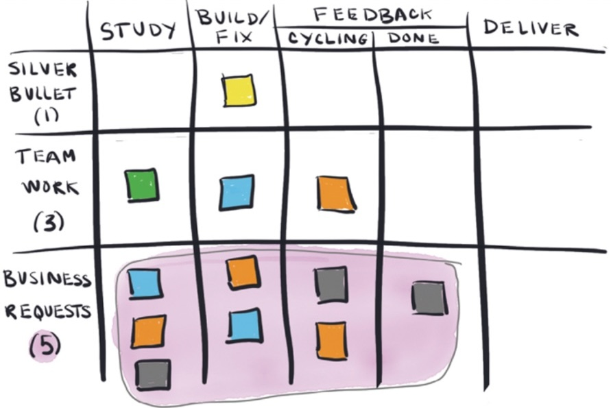
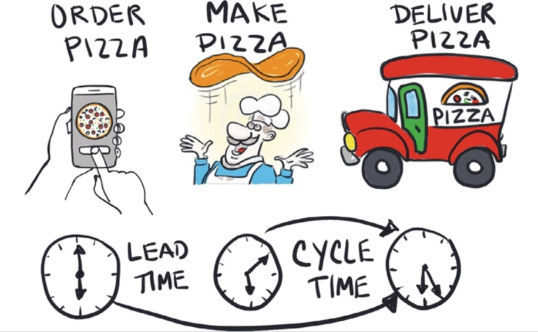
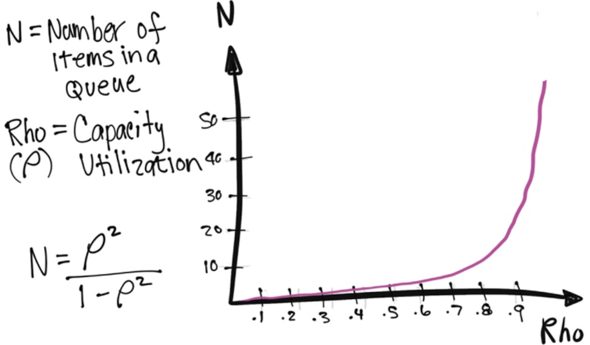

> We need diversity of thought and different ways of working. If we get caught up in the idea that there is a best practice—a perfect way of doing things—then we risk branding fresh perspectives or improvements as inherently flawed ideas.

> The amount of requests (the demand) and the amount of time people have to handle the requests (their capacity) is almost always unbalanced. This is why we need a pull system—in which people can focus on one thing long enough to finish it before starting something new—like kanban.

> Think of long-living branches as a place where code is stored in isolation, where it’s impossible to see the impact it might have on the code already released to production. It’s kind of like adopting an older cat and praying that he and your current, much older cat will embrace each other with open paws.

> Busyness can be an addiction for terminally wired ambitious people. But busyness does not equate to growth or improvement or value. Busyness often means just doing so many things at once that they all turn out crappy.

> When you delay the delivery of a new feature because another request got bundled in with it, there’s a cost for the delay of that new feature. It could mean late feedback, less profit, or a missed sales lead opportunity. Your new feature gets hijacked on its way to your customer, and the more stuff you add, the longer the customer waits. If customers wait too long, they shop elsewhere.

> WIP is a leading indicator of cycle time. The more items that are worked on at the same time, the more doors open up that allow dependencies and interruptions to creep in.

> If I’m writing a blog about kanban and the next step in the process is to have it edited by someone on the Marketing team, then beginning a new blog about DevOps before incorporating Marketing’s edits for the kanban blog means I’ll have to deal with a context switch when the editor gets back to me.

> Dependencies are asymmetrical in their impact. With four dependencies, it’s not a 25% probability you won’t be seated, it’s a 93% (15/16th) probability that you won’t be seated.

> We like small teams because they can move fast. Just realize that by moving fast as an individual team, you may be paying the price of not moving very fast as a whole organization.

> This is the problem with unplanned work—it sets back planned work. It increases uncertainty in the system and makes the system less predictable as a result.

> A major value of the Agile movement is to encourage responding to change over following a plan. Life is uncertain. Change is inevitable.

> The 2016 State of DevOps Report survey data show that high performers are able to spend 28% more time on planned work.

> All essential information is visible on [a Kanban board], so you don’t have to chase down workers to ask them what is happening, and you don’t have to wait for a politically sanitized weekly status report to get a glimpse of transparency.

> The engineers are trying to get clarity on priorities from the project managers, and the project managers are trying to get clarity on statuses from the Operations engineers. In both cases, the common denominator is unclear priorities.

> A team of engineers who look really busy but who are not completing project features are a red flag. Having a bunch of projects that are sitting at 90% complete does the company no good. Sales can’t sell a feature to a customer if the customer cannot access the feature; features are only valuable if customers can use them.

> As Ross Garber says, “Many things may be important, but only one can be the most important.”

> “If it hurts, do it more often,” as the saying goes. Frequency reduces difficulty.

> Thief Neglected Work often plants invisible technical debt in the system, knowing that short-term thinking sways prioritization in favor of new features over protecting valuable assets. Like financial debt, technical debt incurs interest payments, which come in the form of extra effort required to fix software bugs and develop new features.

> Zombie projects are low-value projects that are barely alive. They lurk around looking for handouts, but they get no love. They are starving for money, resources, and people. Nevertheless, they persist, and in doing so, these starving projects subtly siphon people’s time and energy away from higher-value projects. When you discover a zombie project, kill it. Kill it so the more important work will be delivered sooner and with fewer interruptions.

> Purging low-value jobs from the work queue makes sense whenever a surplus of high-value jobs is in progress. In other words, it’s okay to kill zombie projects. If they are really needed, zombie projects can return from the dead. The things that matter the most must not be sidetracked by the things that matter the least.

> Because new work is started at a faster rate than partially completed work already in the pipeline is finished, the work piles up and takes longer to do […] It’s like rush hour traffic. When more cars are entering the freeway than are leaving the freeway, drivers are greeted with a longer commute. And like the traffic jam on the freeway, the ensuing barrage of constant interruptions can bring workflow to a grinding halt.

> Shining a light on how long work sits neglected is a useful exercise to undergo in order to understand the relationship between old work (think zombie projects) and newer, competing projects.

> Making work visible is one of the most fundamental things we can do to improve our work because the human brain is designed to find meaningful patterns and structures in what is perceived through vision.

> Be forewarned—the outcomes of implementing these methods will depend on the investment level of participants from all parts of the organization.

> Some things are so low on the priority list that it doesn’t make sense to clutter your To Do column with them because that will distract you from the most important work. Also, by the time you finish your top three to five priority items, your next set of priorities will probably have changed.

> It’s not uncommon to see teams implement a policy whereby they don’t create cards for work that takes less than fifteen minutes.

> The WIP limits add tension to the system. People are compelled to innovate and resolve issues preventing them from finishing their work. WIP limits provoke necessary conversations.

> The true power of Little’s Law is not in calculating the math but in understanding the assumptions necessary for the law to work in the first place. Using Little’s Law to calculate a quantitative forecast is an incorrect application of the law. Little’s Law is about examining what happened in the past—not about making deterministic predictions about the future.

> It’s true, we like small teams because they can move fast. Just realize that by moving fast as an individual team, you’re less able to move fast at the organization level due to the high coordination impacts from having a large number of dependencies.

> A card is created for every piece of unplanned work. There’s usually resistance to this in the form of Platform Operations Manager Erik, who says, “I don’t have time to create a ticket every time I get interrupted!” But after weeks of interruptions, the CIO wants to know why Azure isn’t up and running in production. And what does Erik say? “We’ve been busy.”

> If every week there is 25–50% unplanned work, then allocate 25–50% of your WIP for potential unplanned work.

> You may be thinking that allocating your workload (your capacity) by WIP limits won’t fly because your work items aren’t all the same size. This is an area where size doesn’t really matter because you can only work on so many things at a time. It doesn’t matter how big or small something is when you can only truly focus on one thing at a time. It could be as small as a mouse or as big as an elephant (metaphorically speaking). When it’s done, you move on to the next thing.

> During the 1960s, the coffee cart at HP rolled around at 10:15 every morning. All the engineers drank coffee and casually discussed top-of-mind issues. It was a goldmine condition that generated spontaneous collaborative advances. A lot of problems got unstuck at that daily coffee cart.

> We are often confident even when we are wrong, and it can be hard for us to see when we are wrong. This is why making prioritization policies visible is vital—it drives the right conversations for delivering ideal outcomes.

> Work takes a long time to complete because it sits in queues waiting for stuff to happen. It’s not unusual for wait times to be more than 80% of the total time. Many organizations are blind to the queue problem. They tend to focus on resource efficiency instead of applying systems thinking to improve the efficiency of the whole system end to end.

> The line of commitment is a vertical line before a specific state that signals a commitment on your part to do the work. The tasks in the backlog are options, and they may never get done. But once work passes the line of commitment, it explicitly signals that it’s been prioritized and is moving forward. It is no longer an option but a fully agreed upon and prioritized piece of work.

> People take on more WIP when they are unclear on priorities.

> This is one of the major problems with neglected work and an important reason why we should avoid it. Once the work has sat untouched for weeks or even months, we forget the details, and it takes a long time to dive back in.

> Multitasking is an effective way to get less done.

> Neglected work is another term for partially completed work. Consider a partially completed bridge. It is already expensive, but it provides zero value until it’s finished.

> Humans are like that. We tend to avoid the annual doctor’s exam until something is really wrong.

> To make neglected work obvious, flag work items that haven’t moved or been updated within a certain number of days.

> Separate repetitive tasks in a dedicated area of your kanban board. It’s important to keep these tasks visible because they increase WIP, and their impact should be acknowledged.

> The five time thieves make themselves at home in traditional companies that drive their business based on costs and margins. It’s harder for them to steal time from Lean organizations that focus on customer and/or business value.

> If expectations are set correctly, not everything needs a due date. Being predictable is what counts.

> Depending on whom you ask, cycle time has different meanings, which I’ll get to shortly. Just know that cycle time is an ambiguous term and that’s why I prefer to use flow time when discussing speed metrics in general, because it is attuned with Lean. It’s actually a main pillar of Lean.

> Unlike most other metrics, WIP is a leading indicator. The more WIP there is in the pipeline, the longer things take to complete, period.

> All you have to do to discredit a metric is to question the assumptions. In order for your metrics to be taken seriously, carefully consider and identify the assumptions in place.

> The more a person or resource is utilized, the bigger the lines (queues) get. And while it’s intuitive at some level, there is some science behind it. It’s called queueing theory.

> [T]he single most important factor that affects queue size is capacity utilization. The reason we care about queue size is because the bigger the queue, the longer things take.

> Focusing on efficiency produces better cost accounting results for large batch-size projects, such as manufacturing commercial airplane engines or publishing books. In knowledge work, however, problems with coordination costs grow nonlinearly with batch size. Old school management assumptions about economies of scale do not apply to knowledge work problems, such as software development.

> We want to avoid the mistake of having a goal to keep people busy all the time when the goal should be to generate value for the business.

> Instead of going around the room, we set a policy that the board must be updated and accurate prior to 9:00 a.m. This allowed people to simply look at the board to see the latest status, and the stand-up could be spent focusing on risk and uncertainty.

> The only time anyone does anything right the first time is when they follow directions given by someone else who has done it many times before.

> Remember, exposing the time thieves is important because it’s ridiculously hard to manage invisible work. When there is too much WIP, there is no time to simply think.

> Your teams may (and in fact, should) argue about the who, what, and when, but the context around why should be well understood.

> Select a WIP limit that is doable but challenges you to say no some of the time.

> Scrum and kanban can work well together. They are more alike than they are different.

> If you take one thing away from this book, make it be saying yes to a balanced workload.
