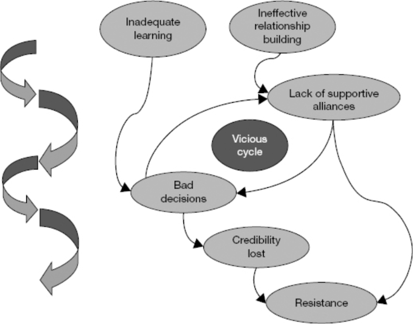
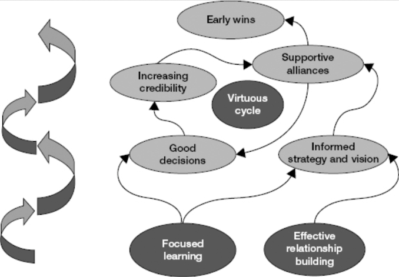

> When I surveyed more than thirteen hundred senior HR leaders, almost 90 percent agreed that “transitions into new roles are the most challenging times in the professional lives of leaders.”1 And nearly three-quarters agreed that “success or failure during the first few months is a strong predictor of overall success or failure in the job.”

> Your goal in every transition is to get as rapidly as possible to the break-even point. This is the point at which you have contributed as much value to your new organization as you have consumed from it. [I]ndependent research has shown that you can reduce the time by as much as 40 percent through rigorous application of the principles described in this book.

Common traps for new leaders include the following:

> Sticking with what you know. You believe you will be successful in the new role by doing the same things you did in your previous role, only more so. You fail to see that success in the new role requires you to stop doing some things and to embrace new competencies.

> Falling prey to the “action imperative.” You feel as if you need to take action, and you try too hard, too early to put your own stamp on the organization. You are too busy to learn, and you make bad decisions and catalyze resistance to your initiatives.

> Setting unrealistic expectations. You don’t negotiate your mandate or establish clear, achievable objectives. You may perform well but still fail to meet the expectations of your boss and other key stakeholders.

> Attempting to do too much. You rush off in all directions, launching multiple initiatives in the hope that some will pay off. People become confused, and no critical mass of resources gets focused on key initiatives.

> Coming in with “the” answer. You come in with your mind made up, or you reach conclusions too quickly about “the” problems and “the” solutions. You alienate people who could help you understand what’s going on, and you squander opportunities to develop support for good solutions.

> Engaging in the wrong type of learning. You spend too much time focused on learning about the technical part of the business and not enough about the cultural and political dimensions of your new role. You don’t build the cultural insight, relationships, and information conduits you need if you’re to understand what is really going on.

> Neglecting horizontal relationships. You spend too much time focused on vertical relationships—up to the boss and down to direct reports—and not enough on peers and other stakeholders. You don’t fully understand what it will take to succeed, and you miss early opportunities to build supportive alliances.

> Leadership ultimately is about influence and leverage. You are, after all, only one person. To be successful, you need to mobilize the energy of many others in your organization.

> Prepare yourself. This means making a mental break from your old job and preparing to take charge in the new one.

> Secure early wins. Early wins build your credibility and create momentum. They create virtuous cycles that leverage the energy you put into the organization to create a pervasive sense that good things are happening.

> Negotiate success. Because no other single relationship is more important, you need to figure out how to build a productive working relationship with your new boss (or bosses) and manage her expectations. This means carefully planning for a series of critical conversations about the situation, expectations, working style, resources, and your personal development. Crucially, it means developing and gaining consensus on your 90-day plan.

> Achieve alignment. The higher you rise in an organization, the more you must play the role of organizational architect. This means figuring out whether the organization’s strategic direction is sound, bringing its structure into alignment with its strategy, and developing the processes and skill bases necessary to realize your strategic intent.

> Build your team. If you are inheriting a team, you need to evaluate, align, and mobilize its members. You likely also need to restructure it to better meet the demands of the situation. Your willingness to make tough early personnel calls and your capacity to select the right people for the right positions are among the most important drivers of success during your transition and beyond.

> Create coalitions. Your success depends on your ability to influence people outside your direct line of control. Supportive alliances, both internal and external, are necessary if you are to achieve your goals. You therefore should start right away to identify those whose support is essential for your success, and to figure out how to line them up on your side.

> Keep your balance. In the personal and professional tumult of a transition, you must work hard to maintain your equilibrium and preserve your ability to make good judgments.

> Accelerate everyone. Finally, you need to help all those in your organization—direct reports, bosses, and peers—accelerate their own transitions. The fact that you’re in transition means they are too. The quicker you can get your new direct reports up to speed, the more you will help your own performance.

> Begin by thinking about your first day in the new job. What do you want to do by the end of that day? Then move to the first week. Then focus on the end of the first month, the second month, and finally the three-month mark. These plans will be sketchy, but the simple act of beginning to plan will help clear your head.

> Accelerate your learning. You need to climb the learning curve as fast as you can in your new organization. This means understanding its markets, products, technologies, systems, and structures, as well as its culture and politics. ... You must be systematic and focused about deciding what you need to learn and how you will learn it most efficiently.

> Match your strategy to the situation. Different types of situations require you to make significant adjustments in how you plan for and execute your transition. ... A clear diagnosis of the situation is an essential prerequisite for developing your action plan.

> At the broadest level, preparing yourself means letting go of the past and embracing the imperatives of the new situation to give yourself a running start. It can be hard work, but it is essential.

> No matter where you land, the keys to effective delegation remain much the same: you build a team of competent people whom you trust, you establish goals and metrics to monitor their progress, you translate higher-level goals into specific responsibilities for your direct reports, and you reinforce them through process.

> One inescapable reality of promotion is that you attract much more attention and a higher level of scrutiny than before. You become the lead actor in a crucial public play. Private moments become fewer, and there is mounting pressure to exhibit the right kind of leadership presence at all times.

> To […] succeed in joining a new company, you should focus on four pillars of effective onboarding: business orientation, stakeholder connection, alignment of expectations, and cultural adaptation.

> [T]here is a natural but dangerous tendency for new leaders to focus on building vertical relationships early in their transitions—up to their bosses and down to their teams. Often, insufficient time is devoted to lateral relationship building with peers and key constituencies outside the new leader’s immediate organization.

> After thirty days, conduct an informal 360-degree check-in with your boss and peers to gauge how adaptation is proceeding.

> Preparing yourself for a new role calls for proactively restructuring your advice-and-counsel network. Early in your career, there is a premium on cultivating good technical advisers—experts in certain aspects of marketing or finance, for instance, who can help you get your work done. As you move to higher levels, however, it becomes increasingly important to get good political counsel and personal advice.

> Paradoxically, when you get promoted, positional authority often becomes less important for pushing agendas forward. […] Decision making becomes more political—less about authority, and more about influence. That isn’t good or bad; it’s simply inevitable.

> The first task in making a successful transition is to accelerate your learning. Effective learning gives you the foundational insights you need as you build your plan for the next 90 days.

> [S]urprisingly few managers have received training in systematically diagnosing organizations. Those who have had such training invariably prove to be either human resource professionals or former management consultants.

> Planning to learn means figuring out in advance what the important questions are and how you can best answer them. Few new leaders take the time to think systematically about their learning priorities. Fewer still explicitly create a learning plan when entering a new role.

> A baseline question you always should ask is, “How did we get to this point?” Otherwise, you risk tearing down existing structures or processes without knowing why they were put there in the first place.

> Effective leaders strike the right balance between doing (making things happen) and being (observing and reflecting). But it is challenging […] to let yourself “be” during transitions. And the pressure to “do” almost always comes more from inside the leader than from outside forces; it reflects a lack of confidence and a consequent need to prove yourself.

> Even in situations (such as turnarounds) when you have been brought in explicitly to import new ways of doing things, you still have to learn about the organization’s culture and politics to socialize and customize your approach.

> Your learning agenda defines what you want to learn. Your learning plan defines how you will go about learning it. ... Your learning plan is a critical part of your overall 90-day plan. In fact, as you will discover later, learning should be a primary focus of your plan for your first 30 days on the job (unless, of course, there is a disaster in progress).

> The first question is, What kind of change am I being called upon to lead? Only by answering this question will you know how to match your strategy to the situation. The second question is, What kind of change leader am I? Here the answer has implications for how you should adjust your leadership style.

> STARS is an acronym for five common business situations leaders may find themselves moving into: start-up, turnaround, accelerated growth, realignment, and sustaining success.

> In reality, you’re unlikely to encounter a pure and tidy example of a start-up, turnaround, accelerated-growth, realignment, or sustaining-success situation. At a high level your situation may fit reasonably neatly into one of these categories. But as soon as you drill down, you will almost certainly discover that you’re managing a portfolio—of products, projects, processes, plants, or people—that represents a mix of STARS situations.

> Whether any leader in transition can adapt her personal leadership strategy successfully depends greatly on the ability to embrace the following pillars of self-management: enhancing self-awareness, exercising personal discipline, and building complementary teams.

> [P]eople seldom call their local power company to say, “Thanks for keeping the lights on today.” But if the power goes off, the screaming is immediate and loud.

> Negotiating success means proactively engaging with your new boss to shape the game so that you have a fighting chance of achieving desired goals. Many new leaders just play the game, reactively taking their situation as given—and failing as a result. The alternative is to shape the game by negotiating with your boss to establish realistic expectations, reach consensus, and secure sufficient resources.

> There is much you can do to build a productive working relationship with your new boss, and you should start doing it as soon as you’re being considered for a new role. Keep it in mind as you participate in interviews, get selected, and formally begin the new job.

> It can be dangerous to say, “Don’t bring me problems, bring me solutions.” Far better is, “Don’t just bring me problems, bring me plans for how we can begin to address them.”

> You need to agree on short- and medium-term goals and on timing. Critically, you need to agree on how your boss will measure progress. What will constitute success, for your boss and for you? When does your boss expect to see results? How will you measure success? Over what time frame? If you succeed, what is next?

> If there are parts of the organization—products, facilities, people—about which your new boss is proprietary, it is essential to identify them as soon as possible. You don’t want to find out that you’re pressing to shut down the product line your boss started up or to replace someone who has been his loyal ally. So try to deduce what your boss is sensitive about.

> One of your immediate tasks is to shape your boss’s perceptions of what you can and should achieve. You may find her expectations unrealistic, or simply at odds with your own beliefs about what needs to be done. If so, you must work hard to make your views converge.

> Be conservative in what you promise. If you deliver more, you will delight your boss. But if you promise too much and fail to deliver, you risk undermining your credibility. Even if you accomplish a great deal, you will have failed in the boss’s eyes.

> Try using the menu approach: lay out the costs and benefits of different levels of resource commitment. “If you want my sales to grow seven percent next year, I need investment of X dollars. If you want ten percent growth, I will need Y dollars.”

> Assume that the job of building a positive relationship with your new boss is 100 percent your responsibility. In short, this means adapting to his style. If your boss hates voice messages, don’t leave them. If he wants to know in detail what is going on, overcommunicate. Of course you should not do anything that could compromise your ability to achieve superior business results, but do look for opportunities to smooth the day-to-day workings of your relationship.

> Your 90-day plan should be written, even if it consists only of bullet points. It should specify priorities and goals as well as milestones. Critically, you should share it with your boss and seek buy-in for it.

> Whatever your own priorities, pinpoint what your boss cares about most, and aim for early wins in those areas. ... The most effective approach is to integrate your boss’s goals with your own efforts to get early wins. If this is impossible, look for early wins based solely on your boss’s priorities.

> To begin to sketch out your plan, divide the 90 days into three blocks of 30 days. At the end of each block, you will have a review meeting with your boss. ... You should typically devote the first block of 30 days to learning and building personal credibility. ... Then you can proceed to develop a learning agenda and learning plan for yourself. Set weekly goals for yourself, and establish a personal discipline of weekly evaluation and planning.

> By the end of the first few months, you want your boss, your peers, and your subordinates to feel that something new, something good, is happening. Early wins excite and energize people and build your personal credibility.

> [B]e careful not to fall into the low-hanging fruit trap. This trap catches leaders when they expend most of their energy seeking early wins that don’t contribute to achieving their longer-term business objectives.

> It’s easy to take on too much during a transition, and the results can be ruinous. You cannot hope to achieve results in more than a couple of areas during your transition. Thus, it’s essential to identify the most promising opportunities and then focus relentlessly on translating them into wins. Think of it as risk management: pursue enough focal points to have a good shot at getting a significant success, but not so many that your efforts get diffused.

> It’s essential to get early wins that energize your direct reports and other employees. But your boss’s opinion about your accomplishments is crucial too. Even if you do not fully endorse her priorities, you must make them central in thinking through which early wins you will aim for.

> You can be sure people have talked to people who have talked to people who have worked with you in the past. So like it or not, you will start your role with a reputation, deserved or not. The risk, of course, is that your reputation will become reality, because people tend to focus on information that confirms their beliefs and screen out information that doesn’t—the so-called confirmation bias. The implication is that you need to figure out what role people are expecting you to play and then make an explicit decision about whether you will reinforce these expectations or confound them.

> Because your earliest actions will have a disproportionate influence on how you’re perceived, think through how you will get connected to your new organization in the first few days in your new role. What messages do you want to get across about who you are and what you represent as a leader? What are the best ways to convey those messages?

> Another reason for predictable surprises is that different parts of the organization have different pieces of the puzzle, but no one puts them together. Every organization has its information silos. If you don’t put processes in place to make sure critical information is surfaced and integrated, then you’re putting yourself at risk of being predictably surprised.

> The higher you climb in organizations, the more you take on the role of organizational architect, creating and aligning the key elements of the organizational system: the strategic direction, structure, core processes, and skill bases that provide the foundation for superior performance. No matter how charismatic you are as a leader, you cannot hope to do much if your organization is fundamentally out of alignment. You will feel as if you’re pushing a boulder uphill every day.

> Your actions during your first few weeks inevitably will have a disproportionate impact, because they are as much about symbolism as about substance. Early actions often get transformed into stories, which can define you as hero or villain. ... How you introduce yourself to the organization, how you treat support staff, how you deal with small irritants—all these pieces of behavior can become the kernels of stories that circulate widely.

> Simply blowing up the existing culture and starting over is rarely the right answer. ... If you send the message that there is nothing good about the existing organization and its culture, you will rob people of a key source of stability in times of change. ... The key is to identify both the good and the bad elements of the existing culture. Elevate and praise the good elements even as you seek to change the bad ones.

> [A]ll your efforts to secure early wins could come to naught if you don’t pay attention to identifying ticking time bombs and preventing them from exploding in your face. ... This often happens because the new leader simply doesn’t look in the right places or ask the right questions.

> Few leaders get systematic training in organizational design. Because leaders typically have limited control over organizational design early in their careers, they learn little about it.

> Aligning an organization is like preparing for a long sailing trip. First, you need to be clear on whether your destination (the mission and goals) and your route (the strategy) are the right ones. Then you can figure out which boat you need (the structure), how to outfit it (the processes), and which mix of crew members is best (the skill bases).

> The underlying point is that there is a logic to organizational alignment. It’s likely to cause problems if you try to change the structure before figuring out whether the direction is the right one.

> Strategic direction encompasses mission, vision, and strategy. Mission is about what will be achieved, vision is about why people should feel motivated to perform at a high level, and strategy is about how resources should be allocated and decisions made to accomplish the mission.

> SWOT is arguably the most useful (and certainly the most misunderstood) framework for conducting strategic analysis. […] The correct approach is to start with the environment and then analyze the organization. The first step is to assess the organization’s external environment, looking for emerging threats and potential opportunities.

> The most important decisions you make in your first 90 days will probably be about people.

> Of course you need to evaluate the impact of previous leadership, but rather than point out others’ mistakes, concentrate on assessing current behavior and results and on making the changes necessary to support improved performance.

> Some leaders make major changes in their teams too precipitously, but it is more common to keep people longer than is wise. Whether because they’re afflicted with hubris (“These people have not performed well because they lacked a leader like me”) or because they shy away from tough personnel calls, leaders end up with less-than-outstanding teams. This means they and the other strong performers must shoulder more of the load themselves.

> It is tempting to launch team-building activities right away, but this approach poses a danger; it strengthens bonds in a group, some of whose members may be leaving. So avoid explicit team-building activities until the team you want is largely in place.

> One way to assess judgment is to work with a person for an extended time and observe whether he is able to (1) make sound predictions and (2) develop good strategies for avoiding problems. Both abilities draw on an individual’s mental models, or ways of identifying the essential features and dynamics of emerging situations and translating those insights into effective action. This is what expert judgment is all about.

> [A]bove all, take care to live the vision you articulate. A vision that is undercut by inconsistent leadership behaviors—by you or members of your team—is worse than no vision at all. Be sure you are prepared to walk the talk.

> Few leaders do a great job of leading team decision making. In part, this is because different types of decisions call for different decision-making processes, but most team leaders stick with one approach. They do this because they have a style with which they are comfortable and because they believe they need to be consistent or risk confusing their direct reports.

> [E]ven though you may reach a decision more quickly by the consult-and-decide route, you won’t necessarily reach the desired outcome faster. In fact, you may end up consuming a lot of time trying to sell the decision after the fact, or finding out that people are not energetically implementing it and having to pressure them.

> If you are a consult-and-decide person, you should consider experimenting with building (sufficient) consensus in suitable situations. If you are a build-consensus person, you should feel free to adopt a consult-and-decide approach when it is appropriate to do so. To avoid confusion, consider explaining to your direct reports what process you’re using and why.

> Establish clear norms about communication. This includes which communication channels will be used and how they will be employed. It also means having explicit agreements concerning responsiveness—for example, that urgent messages will be responded to within a specified time.

> An inspiring vision has the following attributes: ... It taps into sources of inspiration. ... It makes people part of “the story.” ... It contains evocative language.

> To succeed in your new role, you will need the support of people over whom you have no direct authority. You may have little or no relationship capital at the outset, especially if you’re onboarding into a new organization. So you will need to invest energy in building new networks. Start early.

> It also pays to think hard about potential blocking alliances—those who collectively have the power to say no. Who might band together to try to block your agenda, and why? How might they seek to impede the process? If you have a good sense of where opposition might come from, you can work to neutralize it.

> (In the spirit of the golden rule of transitions, consider proactively doing the same thing when you have new direct reports coming on board: create priority relationship lists for them, and help them make contact.)

> Whatever supporters’ reasons for backing you, do not take their support for granted. It’s never enough merely to identify support; you must solidify and nurture it. So don’t forget to preach to the converted.

> Understanding resisters’ motives many equip you to counter their arguments. For example, you may be able to address their fears of appearing incompetent in the new environment by helping them develop new skills.

> There is a lot of good social psychology research showing that we overestimate the impact of personality and underestimate the impact of situational pressures in reaching conclusions about the reasons people act the way they do.

> Choice-shaping is about influencing how people perceive their alternatives.

> Armed with deeper insight into the people you need to influence, you can think about how to apply classic influence techniques such as consultation, framing, choice-shaping, social influence, incrementalism, sequencing, and action-forcing events. Consultation promotes buy-in, and good consultation means engaging in active listening. ... Framing means carefully crafting your persuasive arguments on a person-by-person basis. ... Social influence is the impact of the opinions of others and the rules of the societies in which they live. ... Incrementalism refers to the notion that people can move in desired directions step-by-step when they wouldn’t go in a single leap. ... Sequencing means being strategic about the order in which you seek to influence people to build momentum in desired directions. ... Action-forcing events get people to stop deferring decisions, delaying, and avoiding commitment of scarce resources.

> It’s inevitable that your initial enthusiasm will wane as the excitement of taking on a new challenge wears off and the reality sets in of the challenges you face. It’s common for leaders to go into a valley three to six months after taking a new role.

> Consciously or unconsciously, you may choose to delay by burying yourself in other work or fool yourself into believing that the time isn’t ripe to make the call. The result is what leadership thinkers have termed work avoidance: the tendency to avoid taking the bull by the horns, which results in tough problems becoming even tougher.

> Do you make commitments on the spur of the moment and later regret them? Do you blithely agree to do things in the seemingly remote future, only to kick yourself when the day arrives and your schedule is full? Begin with no; it’s easy to say yes later. It’s difficult (and damaging to your reputation) to say yes and then change your mind.

> It’s a fundamental rule of warfare to avoid fighting on too many fronts. For new leaders, this means stabilizing the home front so that you can devote the necessary attention to work. You cannot hope to create value at work if you’re destroying value at home.

> You will have to fight to manage yourself every single day. Ultimately, your success or failure will flow from all the small choices you make along the way. These choices can create momentum—for the organization and for you—or they can result in vicious cycles that undermine your effectiveness.

> Beyond knowing transition frequencies, it’s valuable to know what the mix is of onboarding, inboarding (moves between units), promotion, and lateral moves. Knowing this allows you to tailor the support you’re providing.

> The foundation of an acceleration system is a unified, companywide framework, language, and toolkit for talking about and planning transitions. This probably is the single most important step your organization can take to build an acceleration system.

> The paradox of transition acceleration is that leaders in transition often feel too busy to learn and plan their transitions. They know they should be tapping into available resources and devoting time to planning their transitions, but the urgent demands of their new roles tend to crowd out this important work.

> Success in accelerating everyone contributes directly to improving company performance. ... An acceleration system is therefore a key element of a high-performance organization.
